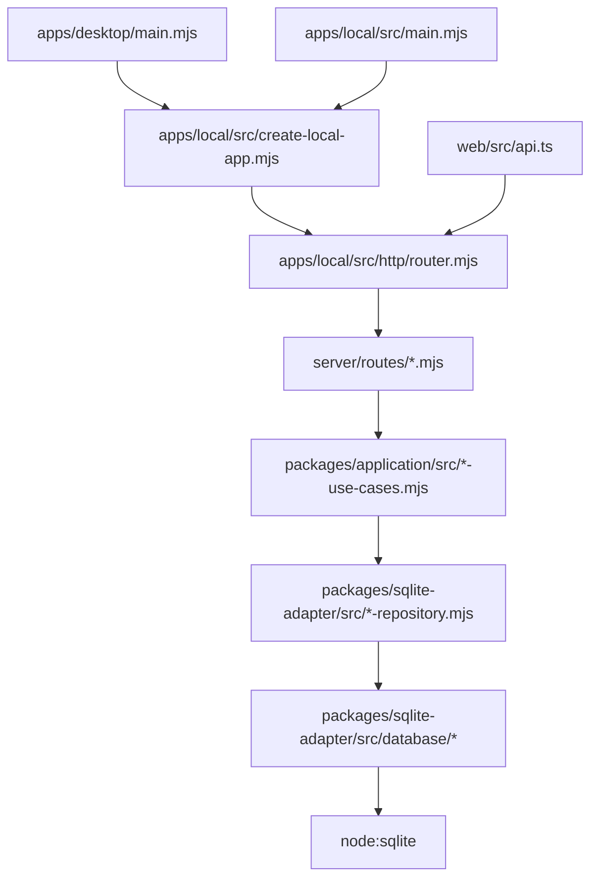

# Estado actual

Este documento describe el código que existe hoy. Para el objetivo de diseño, consulta [`target-state.md`](target-state.md). Para seguir responsabilidades concretas, consulta [`module-destination-map.md`](module-destination-map.md) y los README locales enlazados desde la [guía raíz](../../README.md).

## Diagrama de ejecución



La aplicación React ejecuta este flujo para cada interacción:

```text
web/src/main.tsx
  -> web/src/app/App.tsx
  -> web/src/app/WorkspaceView.tsx
  -> web/src/features/*
  -> web/src/api.ts
  -> /api/*
```

## Responsabilidades por carpeta

| Carpeta | Responsabilidad | Guía de contribución |
|---|---|---|
| `packages/core` | Cálculos deterministas y parámetros de dominio. | [`packages/core/README.md`](../../packages/core/README.md) |
| `packages/contracts` | Puertos de repositorio y contexto. | [`packages/contracts/README.md`](../../packages/contracts/README.md) |
| `packages/application` | Casos de uso con dependencias inyectadas. | [`packages/application/README.md`](../../packages/application/README.md) |
| `packages/api-contracts` | Requests, responses, filtros y errores serializables. | [`packages/api-contracts/README.md`](../../packages/api-contracts/README.md) |
| `packages/sqlite-adapter` | Factory SQLite, migraciones, seeds y repositorios. | [`packages/sqlite-adapter/README.md`](../../packages/sqlite-adapter/README.md) |
| `packages/shared-ui` | Componentes React sin transporte ni persistencia. | [`packages/shared-ui/README.md`](../../packages/shared-ui/README.md) |
| `apps/local` | Composition root, host HTTP y runtime multiplataforma. | [`apps/local/README.md`](../../apps/local/README.md) |
| `apps/desktop` | Adaptador de entrega Electron que envuelve `apps/local` sin mover lógica de negocio. | [`apps/desktop/README.md`](../../apps/desktop/README.md) |
| `server/routes` | Routers HTTP inyectables. | [`server/routes/README.md`](../../server/routes/README.md) |
| `web/src/features` | Módulos de UI y servicios frontend. | [`web/src/features/README.md`](../../web/src/features/README.md) |

## Fronteras verificadas

- `core` no importa infraestructura ni otros paquetes internos.
- `contracts` no importa infraestructura ni otros paquetes internos.
- `shared-ui` no importa `web/src`, `server`, SQLite, `process.env` ni proveedores cloud.
- `apps/local` no importa `server/index.mjs`; `server/index.mjs` es la dirección inversa y actúa como fachada.
- `apps/desktop` depende de `apps/local`, pero `apps/local` no depende de Electron.
- La base SQLite no se abre al importar `@personal-tax-ledger/local-app` o `@personal-tax-ledger/sqlite-adapter`.
- Los paquetes y el consumidor externo tienen tests propios; la integración adicional vive en `server/test`.

La comprobación automática está en [`scripts/architecture-check.mjs`](../../scripts/architecture-check.mjs) y se ejecuta con `npm run architecture:check`.

## Lifecycle y persistencia

`createLocalComposition()` crea una conexión compartida mediante `createSqliteDatabase()`. `createLocalApp().stop()` cierra primero el servidor y luego la conexión. En el runtime local tradicional `DB_PATH` se resuelve desde el directorio de ejecución; consulta [`packages/sqlite-adapter/src/database/README.md`](../../packages/sqlite-adapter/src/database/README.md).

En Electron, `apps/desktop/main.mjs` define `DB_PATH` dentro de `app.getPath('userData')/data` antes de crear `apps/local`. Esto separa los datos persistentes del workspace y permite mantener intacto el runtime local existente.

## Deuda conocida

Los documentos históricos en `docs/gaps/` conservan hallazgos de sesiones anteriores. No todos describen el estado actual: cada uno debe leerse junto con su fecha y la evidencia posterior en el historial de Git. Los gaps abiertos de negocio y producto siguen indexados en [`docs/gaps/README.md`](../gaps/README.md). Para la transición Electron consulta [`docs/gaps/2026-09-04-electron-packaging.md`](../gaps/2026-09-04-electron-packaging.md).
