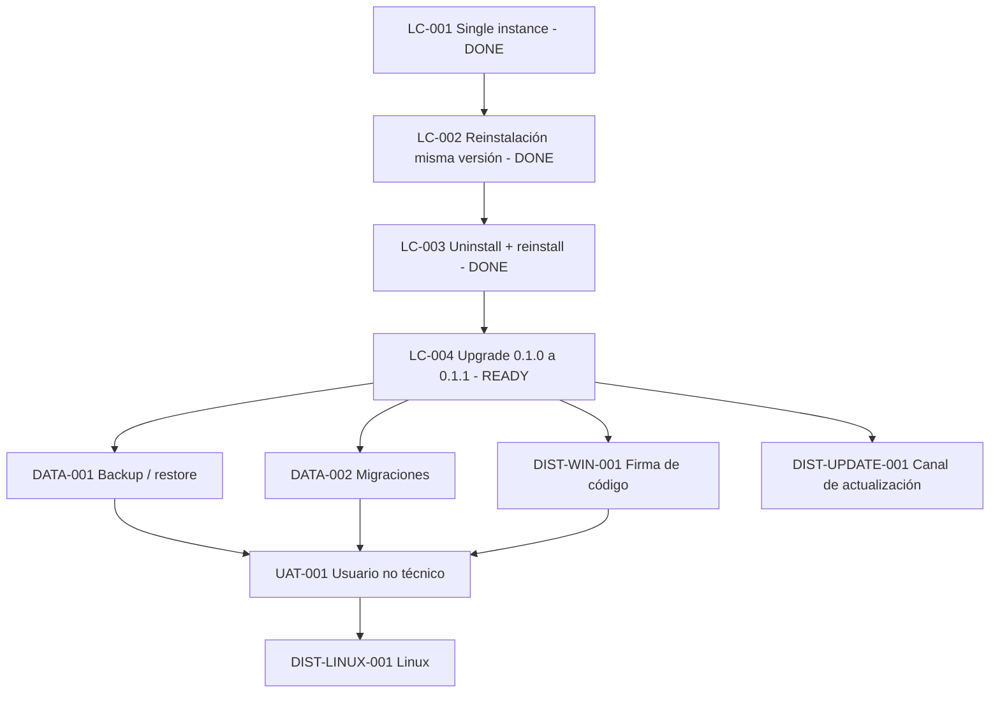

# Backlog — Desktop lifecycle y distribución

Estado general: `IN_PROGRESS`

Este backlog continúa el cierre del slice desktop de Personal Tax Ledger después de haber validado arquitectura, packaging Windows x64, instalación, persistencia básica y reproducibilidad del instalador. El objetivo de esta fase es demostrar el comportamiento del producto durante su lifecycle real como aplicación instalada y dejar una base segura para UAT no técnico y futuras plataformas.

## Orden de ejecución

1. Single-instance explícito. ✅ DONE
2. Reinstalación de la misma versión. ✅ DONE
3. Desinstalación + reinstalación con continuidad de datos. ✅ DONE
4. Upgrade real entre versiones `0.1.0 -> 0.1.1`. ⏭️ NEXT
5. Backup / export / restore.
6. Migraciones formales de esquema y compatibilidad de datos.
7. Firma de código y experiencia SmartScreen.
8. UAT con usuario no técnico.
9. Distribución Linux nativa.
10. Canal de actualización posterior, si se adopta autoupdate o distribución administrada.

---

## PTL-DESKTOP-LC-001 — Single-instance explícito

Estado: `DONE`
Prioridad: `P0`
Tipo: gate funcional / lifecycle desktop
Plataforma: Windows x64
Cierre observado: `2026-09-06`

### Propósito

Verificar de forma explícita que una instalación de Personal Tax Ledger admite una única instancia de aplicación por sesión y que un segundo lanzamiento no crea un segundo runtime, una segunda ventana independiente ni una segunda instancia de acceso concurrente a la base local.

La implementación actual solicita un lock de instancia mediante Electron y escucha el evento `second-instance`. Si existe una ventana principal, el comportamiento esperado es restaurarla si está minimizada y llevarla al foco.

### Riesgo que controla

Sin este gate podrían coexistir dos procesos de aplicación con runtimes locales independientes apuntando a la misma persistencia, generando comportamiento confuso para el usuario y un riesgo innecesario de concurrencia sobre la base local.

### Precondiciones

- Personal Tax Ledger instalado mediante el instalador Windows vigente.
- La aplicación debe abrir correctamente en un lanzamiento normal.
- No se requiere modificar datos para este gate.

### Procedimiento manual

#### Caso A — segunda apertura con ventana visible

1. Abrir Personal Tax Ledger desde el acceso instalado.
2. Esperar a que la ventana principal termine de cargar.
3. Mantener la aplicación abierta.
4. Ejecutar nuevamente el mismo acceso de Personal Tax Ledger.
5. Observar el comportamiento durante algunos segundos.

Resultado esperado:

- no aparece una segunda ventana independiente;
- la instancia ya abierta continúa siendo la única ventana funcional;
- la aplicación existente recibe foco;
- no aparece un error visible.

Resultado observado: `PASS`.

#### Caso B — segunda apertura con ventana minimizada

1. Con Personal Tax Ledger abierto, minimizar la ventana.
2. Ejecutar nuevamente el acceso instalado.
3. Observar el comportamiento.

Resultado esperado:

- la ventana existente se restaura;
- la ventana recibe foco;
- no se crea una segunda ventana independiente.

Resultado observado: `PASS`.

### Criterios de aceptación

El gate queda `PASS` sólo si ambos casos cumplen:

- una única experiencia de aplicación visible;
- restauración desde minimizado al segundo lanzamiento;
- foco de la instancia existente;
- sin error de usuario;
- sin pérdida de funcionalidad después del segundo lanzamiento.

### Evidencia persistida

- Fecha: `2026-09-06`.
- Plataforma: Windows x64 nativo.
- Caso A — ventana visible: `PASS`.
- Caso B — ventana minimizada: `PASS`.
- Observación: no se reportaron errores ni segunda ventana visible.

### Condición de cierre

`DONE`: ambos casos fueron observados en Windows y la evidencia quedó persistida en la documentación canónica.

---

## PTL-DESKTOP-LC-002 — Reinstalación de la misma versión

Estado: `DONE`
Prioridad: `P0`
Depende de: `PTL-DESKTOP-LC-001` ✅
Cierre observado: `2026-09-06`

### Propósito

Demostrar que ejecutar nuevamente el instalador de la misma versión sobre una instalación existente mantiene la aplicación operativa y conserva los datos del usuario.

### Procedimiento ejecutado

1. Se creó un dato de prueba claramente identificable con marcador `LC-002-REINSTALL-TEST`.
2. Se cerró PTL.
3. Se ejecutó nuevamente el mismo `PersonalTaxLedger-Setup.exe` sobre la instalación existente.
4. Se completó la reinstalación.
5. Se abrió PTL nuevamente.
6. Se verificó persistencia y funcionamiento posterior.

### Resultado observado

- reinstalación completada: `PASS`;
- launch posterior: `PASS`;
- dato `LC-002-REINSTALL-TEST` presente después de reinstalar: `PASS`;
- duplicación evidente del dato: no observada;
- error funcional visible: no observado;
- continuidad de persistencia local: `PASS`.

### Criterios de aceptación

- instalación completada sin corrupción; ✅
- launch posterior correcto; ✅
- dato previo presente; ✅
- no duplicación evidente de datos; ✅
- no pérdida de configuración relevante observada. ✅

### Hallazgos no bloqueantes detectados durante el gate

La prueba reveló fricción visual con contenido tabular largo: algunos valores extensos fuerzan crecimiento horizontal y generan scroll horizontal de la superficie. Este hallazgo no invalida LC-002 porque no afecta instalación, persistencia ni operatividad del lifecycle. Se registra como backlog UX separado para tratamiento controlado después del cierre de los gates P0 de lifecycle, salvo que se convierta en blocker funcional.

Referencia: `docs/backlog/ux-and-product-polish.md`.

### Condición de cierre

`DONE`: reinstalación de misma versión observada en Windows, dato previo preservado y evidencia persistida.

---

## PTL-DESKTOP-LC-003 — Desinstalación + reinstalación

Estado: `DONE`
Prioridad: `P0`
Depende de: `PTL-DESKTOP-LC-002` ✅
Cierre observado: `2026-09-06`

### Propósito

Confirmar que el lifecycle de desinstalación elimina la aplicación pero preserva los datos de usuario, y que una instalación posterior vuelve a encontrar esa información.

### Procedimiento ejecutado

1. Se cerró PTL.
2. Se desinstaló desde Windows.
3. Se ejecutó nuevamente el mismo `PersonalTaxLedger-Setup.exe`.
4. Se completó la nueva instalación.
5. Se abrió PTL.
6. Se verificó que el registro marcador `LC-002-REINSTALL-TEST` continuara presente y que la aplicación siguiera operativa.

### Resultado observado

- desinstalación: `PASS`;
- reinstalación posterior: `PASS`;
- launch posterior: `PASS`;
- dato previo preservado: `PASS`;
- no se requirió recrear manualmente la base;
- no se reportaron residuos que impidieran reinstalar;
- sin errores funcionales visibles reportados.

### Criterios de aceptación

- desinstalación completada; ✅
- nueva instalación funcional; ✅
- datos de usuario preservados; ✅
- no se requiere recrear manualmente la base; ✅
- no se observan residuos de aplicación que impidan reinstalar. ✅

### Condición de cierre

`DONE`: uninstall/reinstall observado de forma dedicada en Windows, con continuidad de datos y evidencia persistida.

---

## PTL-DESKTOP-LC-004 — Upgrade real entre versiones

Estado: `READY_TO_EXECUTE`
Prioridad: `P0`
Depende de: `PTL-DESKTOP-LC-003` ✅
Par de versión planificado: `0.1.0 -> 0.1.1`

### Propósito

Validar un upgrade real con cambio de versión del producto, usando como baseline la instalación `0.1.0` ya validada y generando una nueva versión `0.1.1`.

### Alcance controlado

El gate debe probar el mecanismo de upgrade, no mezclarlo con una migración funcional de gran alcance. La versión `0.1.1` debe mantener compatibilidad con los datos existentes y limitar el cambio funcional a modificaciones pequeñas y controladas.

### Precondiciones

- versión `0.1.0` instalada y operativa;
- dato marcador `LC-002-REINSTALL-TEST` preservado;
- LC-001, LC-002 y LC-003 cerrados;
- nuevo instalador `0.1.1` construido desde el repositorio canónico.

### Procedimiento esperado

1. Confirmar que `0.1.0` está instalada y que el marcador sigue disponible.
2. Preparar versión canónica `0.1.1`.
3. Generar `PersonalTaxLedger-Setup.exe` de `0.1.1`.
4. Cerrar PTL `0.1.0`.
5. Ejecutar el instalador `0.1.1` directamente sobre `0.1.0`, sin desinstalación previa.
6. Abrir PTL después del upgrade.
7. Verificar que los datos existentes, incluido `LC-002-REINSTALL-TEST`, continúen disponibles.
8. Verificar que la aplicación sea la versión `0.1.1` y que la navegación básica siga operativa.

### Criterios de aceptación

- upgrade completado; 
- aplicación abre en `0.1.1`;
- datos de `0.1.0` siguen disponibles;
- no se requiere desinstalar `0.1.0` previamente;
- accesos de aplicación siguen funcionando;
- la versión instalada corresponde a `0.1.1`;
- no aparecen duplicados ni errores visibles asociados al upgrade.

### Evidencia mínima

- evidencia reproducible de build del instalador `0.1.1`;
- instalación `0.1.1` sobre `0.1.0` observada en Windows;
- marcador previo visible después del upgrade;
- confirmación de versión instalada;
- resultado PASS/FAIL.

---

## PTL-DATA-001 — Backup / export / restore

Estado: `BACKLOG`
Prioridad: `P1`

### Objetivo

Definir una capacidad explícita para respaldar, exportar y restaurar información del usuario sin depender de copiar manualmente archivos internos de la aplicación.

### Decisiones pendientes

- formato de backup;
- export funcional vs snapshot técnico;
- alcance de configuraciones incluidas;
- validación de integridad;
- compatibilidad entre versiones;
- UX de restauración y manejo de conflictos.

### Gate mínimo futuro

Crear información -> exportar/respaldar -> eliminar o usar instalación limpia -> restaurar -> verificar equivalencia funcional de datos.

---

## PTL-DATA-002 — Migraciones formales de esquema

Estado: `BACKLOG`
Prioridad: `P1`
Depende conceptualmente de: `PTL-DESKTOP-LC-004`

### Objetivo

Garantizar que cambios futuros en SQLite tengan una estrategia versionada, incremental, idempotente cuando corresponda y verificable mediante tests y upgrade de instalaciones reales.

### Criterios futuros

- versión de esquema identificable;
- migraciones ordenadas;
- backup o estrategia de recovery antes de cambios destructivos;
- test desde al menos una versión previa soportada;
- fallo explícito y recuperable ante migración incompleta.

---

## PTL-DIST-WIN-001 — Firma de código y SmartScreen

Estado: `BACKLOG`
Prioridad: `P1`

### Objetivo

Evaluar e implementar, cuando sea viable, firma de código para mejorar la confianza de instalación en Windows y reducir fricción asociada a aplicaciones no firmadas.

### Alcance

- estrategia de certificado;
- integración de firma con packaging;
- timestamping;
- firma de ejecutable/installer según corresponda;
- validación en Windows limpio;
- documentación de experiencia esperada de SmartScreen.

No bloquear UAT técnico actual por ausencia de firma, pero tratarlo como requisito antes de distribución más amplia.

---

## PTL-UAT-001 — UAT con usuario no técnico

Estado: `BACKLOG`
Prioridad: `P1`
Depende de: lifecycle Windows suficientemente cerrado

### Objetivo

Validar que una persona sin contexto de desarrollo pueda instalar, abrir, comprender el flujo básico y utilizar PTL sin asistencia técnica continua.

### Dimensiones a observar

- comprensión del instalador;
- descubrimiento de la aplicación después de instalar;
- onboarding;
- lenguaje funcional;
- registro de datos;
- recuperación ante error de ingreso;
- claridad de Resumen y Escenarios;
- cierre/reapertura;
- percepción de confianza;
- necesidades de ayuda contextual.

El UAT debe producir hallazgos de UX accionables, no sólo una calificación binaria.

---

## PTL-DIST-LINUX-001 — Distribución Linux nativa

Estado: `BACKLOG`
Prioridad: `P2`

### Objetivo

Extender la superficie desktop a Linux reutilizando la arquitectura y staging existentes, pero definiendo packaging e integración de escritorio nativos.

### Trabajo esperado

- seleccionar formatos de distribución iniciales;
- packaging Electron para Linux;
- iconografía y desktop entry;
- ubicación de datos bajo convenciones del sistema;
- instalación/desinstalación;
- single-instance;
- persistencia;
- upgrade o política de actualización;
- UAT nativo.

Linux se considera próximo target, no una capacidad actualmente validada.

---

## PTL-DIST-UPDATE-001 — Canal de actualización

Estado: `BACKLOG`
Prioridad: `P2`
Depende de: `PTL-DESKTOP-LC-004`

### Objetivo

Definir si PTL requiere autoupdate, actualización manual asistida o un canal administrado de releases. La decisión debe considerar simplicidad, confianza, reproducibilidad y operación real antes de incorporar infraestructura adicional.

---

## Secuencia de gates

## Definición de salida de esta fase

La fase desktop Windows puede considerarse suficientemente estabilizada para UAT no técnico cuando:

- single-instance esté observado; ✅
- reinstalación misma versión esté observada; ✅
- uninstall/reinstall esté observado; ✅
- al menos un upgrade real entre versiones esté observado;
- no existan pérdidas de datos conocidas asociadas al lifecycle;
- la evidencia esté persistida y sea reproducible.
