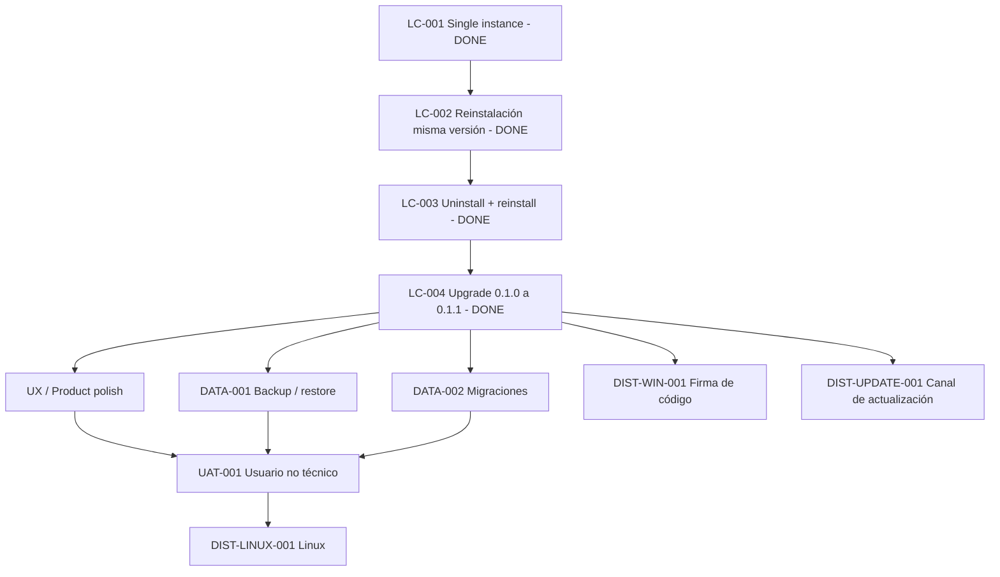

# Backlog — Desktop lifecycle y distribución

Estado general: `IN_PROGRESS`

Este backlog continúa el cierre del slice desktop de Personal Tax Ledger después de haber validado arquitectura, packaging Windows x64, instalación, persistencia y reproducibilidad del instalador. El objetivo es controlar explícitamente el lifecycle real de la aplicación instalada y preparar los siguientes slices de datos, distribución y UAT.

## Estado ejecutivo

| ID | Slice / gate | Prioridad | Estado |
|---|---|---:|---|
| `PTL-DESKTOP-LC-001` | Single-instance explícito | P0 | ✅ DONE |
| `PTL-DESKTOP-LC-002` | Reinstalación misma versión | P0 | ✅ DONE |
| `PTL-DESKTOP-LC-003` | Uninstall + reinstall | P0 | ✅ DONE |
| `PTL-DESKTOP-LC-004` | Upgrade real `0.1.0 -> 0.1.1` | P0 | ✅ DONE |
| `PTL-DATA-001` | Backup / export / restore | P1 | BACKLOG |
| `PTL-DATA-002` | Migraciones formales de esquema | P1 | BACKLOG |
| `PTL-DIST-WIN-001` | Firma de código / SmartScreen | P1 | BACKLOG |
| `PTL-UAT-001` | UAT con usuario no técnico | P1 | BACKLOG |
| `PTL-DIST-LINUX-001` | Distribución Linux nativa | P2 | BACKLOG |
| `PTL-DIST-UPDATE-001` | Canal de actualización | P2 | BACKLOG |

## Orden de ejecución vigente

1. Single-instance explícito. ✅ DONE
2. Reinstalación de la misma versión. ✅ DONE
3. Desinstalación + reinstalación con continuidad de datos. ✅ DONE
4. Upgrade real `0.1.0 -> 0.1.1`. ✅ DONE
5. Backup / export / restore.
6. Migraciones formales de esquema y compatibilidad de datos.
7. Resolver backlog UX/polish necesario antes de UAT no técnico.
8. Firma de código y experiencia SmartScreen, cuando sea viable.
9. UAT con usuario no técnico.
10. Distribución Linux nativa.
11. Canal de actualización posterior, si se adopta autoupdate o distribución administrada.

---

## PTL-DESKTOP-LC-001 — Single-instance explícito

Estado: `DONE`
Prioridad: `P0`
Tipo: gate funcional / lifecycle desktop
Plataforma: Windows x64
Cierre observado: `2026-09-06`

### Propósito

Verificar que una instalación de Personal Tax Ledger admite una única instancia por sesión y que un segundo lanzamiento no crea una segunda ventana independiente ni un segundo runtime visible.

### Implementación relevante

Electron utiliza `app.requestSingleInstanceLock()` y escucha `second-instance`. Si la ventana principal está minimizada, se restaura; luego recibe foco.

### Riesgo controlado

Evita múltiples experiencias de aplicación concurrentes sobre la misma persistencia local y reduce riesgo de comportamiento confuso o concurrencia innecesaria.

### Casos observados

| Caso | Resultado |
|---|---|
| Segundo lanzamiento con ventana visible | PASS |
| Segundo lanzamiento con ventana minimizada | PASS |

### Resultado

- no apareció una segunda ventana independiente;
- la instancia existente continuó operativa;
- la ventana minimizada se restauró;
- la ventana existente recibió foco;
- no se reportaron errores visibles.

Condición de cierre: `DONE`.

---

## PTL-DESKTOP-LC-002 — Reinstalación de la misma versión

Estado: `DONE`
Prioridad: `P0`
Depende de: `PTL-DESKTOP-LC-001` ✅
Cierre observado: `2026-09-06`

### Propósito

Demostrar que ejecutar nuevamente el instalador de la misma versión sobre una instalación existente mantiene la aplicación operativa y conserva los datos del usuario.

### Procedimiento observado

1. Se creó el dato marcador `LC-002-REINSTALL-TEST`.
2. Se cerró PTL.
3. Se ejecutó nuevamente el mismo `PersonalTaxLedger-Setup.exe` sobre la instalación existente.
4. Se completó la reinstalación.
5. Se abrió PTL nuevamente.
6. Se verificó persistencia y funcionamiento posterior.

### Resultado

- reinstalación: `PASS`;
- launch posterior: `PASS`;
- dato previo presente: `PASS`;
- duplicación evidente: no observada;
- error funcional visible: no observado;
- continuidad de persistencia local: `PASS`.

### Hallazgo no bloqueante

Durante este gate se detectó que contenido tabular muy largo puede provocar crecimiento y scroll horizontal. El hallazgo está separado en `docs/backlog/ux-and-product-polish.md` y no invalida el lifecycle.

Condición de cierre: `DONE`.

---

## PTL-DESKTOP-LC-003 — Desinstalación + reinstalación

Estado: `DONE`
Prioridad: `P0`
Depende de: `PTL-DESKTOP-LC-002` ✅
Cierre observado: `2026-09-06`

### Propósito

Confirmar que la desinstalación elimina la aplicación instalada sin destruir la persistencia del usuario y que una instalación posterior vuelve a encontrar la información existente.

### Procedimiento observado

1. Se cerró PTL.
2. Se desinstaló desde Windows.
3. Se ejecutó nuevamente el mismo Setup.
4. Se completó una instalación nueva.
5. Se abrió PTL.
6. Se verificó el marcador `LC-002-REINSTALL-TEST`.

### Resultado

- desinstalación: `PASS`;
- reinstalación posterior: `PASS`;
- launch posterior: `PASS`;
- dato previo preservado: `PASS`;
- recreación manual de la base: no requerida;
- residuos que impidieran reinstalar: no observados;
- error funcional visible: no observado.

Condición de cierre: `DONE`.

---

## PTL-DESKTOP-LC-004 — Upgrade real entre versiones

Estado: `DONE`
Prioridad: `P0`
Depende de: `PTL-DESKTOP-LC-003` ✅
Par validado: `0.1.0 -> 0.1.1`
Cierre observado: `2026-09-06`

### Propósito

Validar un upgrade real in-place entre versiones consecutivas manteniendo datos, accesos y operatividad principal de la aplicación.

### Preparación reproducible observada

La versión `0.1.1` se preparó desde el repositorio canónico con:

- baseline `0.1.0` confirmada;
- `package.json` y root de `package-lock.json` actualizados a `0.1.1`;
- `npm ci`: exit `0`;
- `npm audit`: `0 vulnerabilities`;
- `desktop:check`: exit `0`;
- `desktop:installer:win`: exit `0`;
- `PersonalTaxLedger-0.1.1-full.nupkg`: generado;
- `PersonalTaxLedger-Setup.exe`: generado;
- `RELEASES`: generado;
- commit de versión: `1f3f71c release: prepare desktop upgrade 0.1.1`;
- push a `master`: `PASS`.

### Validación nativa observada

Baseline de datos: marcador `LC-002-REINSTALL-TEST` existente en la instalación `0.1.0`.

Procedimiento:

1. Se confirmó la instalación `0.1.0` operativa.
2. Se cerró PTL.
3. Se ejecutó el Setup `0.1.1` directamente sobre `0.1.0`.
4. No se desinstaló `0.1.0` previamente.
5. Se abrió PTL después del upgrade.
6. Se verificaron datos, versión y navegación básica.

### Resultado

| Criterio | Resultado |
|---|---|
| Upgrade in-place `0.1.0 -> 0.1.1` | PASS |
| Desinstalación previa requerida | No |
| Launch posterior | PASS |
| Dato previo preservado | PASS |
| Duplicación evidente | No observada |
| Navegación básica | PASS |
| Versión instalada | `0.1.1` |
| Error funcional visible asociado al upgrade | No observado |

### Conclusión del gate

El mecanismo actual de distribución Windows soportó un upgrade real entre versiones consecutivas sin pérdida observable de datos ni regresión funcional básica.

Condición de cierre: `DONE`.

---

## Cierre de la fase P0 de lifecycle Windows

Los cuatro gates P0 están cerrados:

- single-instance: ✅;
- reinstall misma versión: ✅;
- uninstall/reinstall: ✅;
- upgrade real entre versiones: ✅.

Esto demuestra continuidad de datos en los escenarios básicos de lifecycle de la aplicación instalada. No implica todavía que backup, migraciones de esquema, firma, actualización automática o UAT no técnico estén resueltos; esos son slices independientes.

---

## PTL-DATA-001 — Backup / export / restore

Estado: `BACKLOG`
Prioridad: `P1`

### Objetivo

Definir una capacidad explícita para respaldar, exportar y restaurar información del usuario sin depender de copiar manualmente archivos internos de la aplicación.

### Decisiones pendientes

- formato de backup;
- export funcional vs snapshot técnico;
- alcance de configuraciones incluidas;
- validación de integridad;
- compatibilidad entre versiones;
- UX de restauración y manejo de conflictos.

### Gate mínimo futuro

Crear información → respaldar/exportar → usar instalación limpia o remover datos de prueba → restaurar → verificar equivalencia funcional.

---

## PTL-DATA-002 — Migraciones formales de esquema

Estado: `BACKLOG`
Prioridad: `P1`
Depende conceptualmente de: `PTL-DESKTOP-LC-004` ✅

### Objetivo

Garantizar que cambios futuros en SQLite tengan una estrategia versionada, incremental, verificable y recuperable.

### Criterios futuros

- versión de esquema identificable;
- migraciones ordenadas;
- estrategia de recovery antes de cambios destructivos;
- test desde al menos una versión previa soportada;
- fallo explícito y recuperable ante migración incompleta;
- evidencia de upgrade real con cambio de esquema cuando corresponda.

---

## PTL-DIST-WIN-001 — Firma de código y SmartScreen

Estado: `BACKLOG`
Prioridad: `P1`

### Objetivo

Evaluar e implementar, cuando sea viable, firma de código para mejorar la confianza de instalación en Windows y reducir fricción asociada a aplicaciones no firmadas.

### Alcance

- estrategia de certificado;
- integración de firma con packaging;
- timestamping;
- firma de ejecutable e installer según corresponda;
- validación en Windows limpio;
- documentación de experiencia esperada de SmartScreen.

La ausencia de firma no invalida los gates técnicos ya ejecutados, pero debe revisarse antes de una distribución más amplia.

---

## PTL-UAT-001 — UAT con usuario no técnico

Estado: `BACKLOG`
Prioridad: `P1`
Depende de: lifecycle Windows cerrado + polish UX mínimo previo

### Objetivo

Validar que una persona sin contexto de desarrollo pueda instalar, abrir, comprender y utilizar PTL sin asistencia técnica continua.

### Dimensiones a observar

- comprensión del instalador;
- descubrimiento de la aplicación después de instalar;
- onboarding;
- lenguaje funcional;
- registro y edición de datos;
- recuperación ante error de ingreso;
- claridad de Resumen y Escenarios;
- cierre/reapertura;
- percepción de confianza;
- necesidades de ayuda contextual;
- fricciones visuales o de navegación.

El UAT debe producir hallazgos accionables, no sólo una calificación binaria.

---

## PTL-DIST-LINUX-001 — Distribución Linux nativa

Estado: `BACKLOG`
Prioridad: `P2`

### Objetivo

Extender la superficie desktop a Linux reutilizando la arquitectura y staging existentes, pero definiendo packaging e integración de escritorio nativos.

### Trabajo esperado

- seleccionar formatos iniciales de distribución;
- packaging Electron Linux;
- iconografía y desktop entry;
- ubicación de datos según convenciones del sistema;
- instalación/desinstalación;
- single-instance;
- persistencia;
- upgrade o política de actualización;
- UAT nativo.

Linux sigue siendo próximo target, no capacidad actualmente validada.

---

## PTL-DIST-UPDATE-001 — Canal de actualización

Estado: `BACKLOG`
Prioridad: `P2`
Depende de: `PTL-DESKTOP-LC-004` ✅

### Objetivo

Definir si PTL requiere autoupdate, actualización manual asistida o un canal administrado de releases. La decisión debe considerar simplicidad, confianza, reproducibilidad y operación real antes de incorporar infraestructura adicional.

---

## Secuencia de gates

## Definición de salida de la fase lifecycle Windows

La fase P0 de lifecycle Windows se considera cerrada porque:

- single-instance fue observado; ✅
- reinstalación de misma versión fue observada; ✅
- uninstall/reinstall fue observado; ✅
- upgrade real `0.1.0 -> 0.1.1` fue observado; ✅
- no se observaron pérdidas de datos asociadas a estos escenarios; ✅
- la evidencia quedó persistida. ✅

El trabajo continúa con capacidades de protección de datos, migraciones, polish UX y preparación de UAT no técnico.