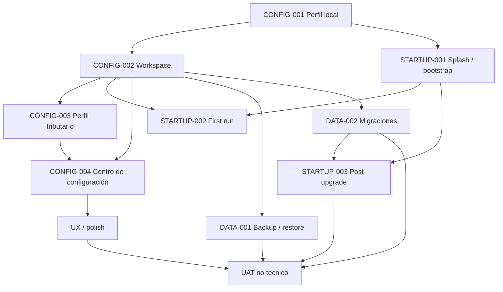

# Backlog — Perfil local, workspace y experiencia de inicio

Estado general: `READY_TO_START`
Prioridad de fase: `P0`

Este slice pasa a ser el **siguiente trabajo prioritario** de Personal Tax Ledger después del cierre de los gates P0 de lifecycle Windows. Antes de implementar backup/restore, migraciones, polish UX o UAT no técnico, la aplicación debe tener un modelo explícito de **perfil local de usuario**, **workspace activo** y **bootstrap de inicio**.

La palabra “cuenta” en este contexto **no implica autenticación remota**. PTL sigue siendo una aplicación local-first. El concepto correcto es un perfil local bajo el cual opera la instalación: identifica al contribuyente/usuario de trabajo, sus preferencias, el workspace activo y la información tributaria estable que sirve de contexto para cálculos y futuras automatizaciones.

## Problema actual

La aplicación desktop arranca directamente hacia la interfaz principal y la persistencia se resuelve automáticamente bajo el directorio interno de datos de Electron. Esto ha sido suficiente para validar packaging y lifecycle, pero no es todavía una experiencia de producto completa.

Faltan capacidades de primer nivel:

- identificar qué perfil local está usando la aplicación;
- seleccionar o crear explícitamente un workspace;
- distinguir configuración de aplicación de datos tributarios del workspace;
- registrar datos personales/tributarios estables reutilizables;
- permitir cambiar de workspace sin manipular archivos internos;
- preparar backup/export/restore a partir de un workspace explícito;
- mostrar una pantalla de inicio/splash durante bootstrap;
- diferenciar primer uso, apertura normal y primera apertura después de una actualización.

---

## Principios de diseño

1. **Local-first**: ningún dato personal o tributario requiere una cuenta cloud para operar.
2. **Separación App vs Workspace**: la configuración propia de la instalación no debe confundirse con los datos tributarios del usuario.
3. **Workspace explícito**: el usuario debe saber dónde vive su información y poder elegirla.
4. **Sin paths técnicos en UX normal**: la interfaz debe hablar de “workspace”, “carpeta de trabajo” o equivalente, no de `userData`, SQLite o rutas internas salvo en una sección avanzada.
5. **Persistencia durable**: upgrades, reinstalaciones y cambios de versión no deben cambiar silenciosamente el workspace activo.
6. **Datos sensibles minimizados**: almacenar sólo información tributaria útil; evitar recopilar datos que PTL no necesite.
7. **Migrable**: el modelo debe permitir que la persistencia actual sea adoptada como workspace inicial sin pérdida de datos.
8. **Observable**: los cambios de workspace y migraciones deben tener validación, feedback y recuperación clara.
9. **Bootstrap visible**: la aplicación no debe aparecer “de golpe”; el usuario debe ver que PTL está iniciando, cargando y verificando su workspace.
10. **First-run y post-upgrade son estados distintos**: ambos requieren UX específica.

---

# PTL-CONFIG-001 — Modelo de perfil local

Estado: `READY_TO_DESIGN`
Prioridad: `P0`
Tipo: capability foundation

## Propósito

Introducir una entidad/configuración de perfil local que represente al usuario/contribuyente bajo el cual opera PTL en esa instalación, sin incorporar todavía autenticación remota.

## Alcance mínimo

El perfil local debería poder contener:

- nombre o alias visible del perfil;
- nombre completo del contribuyente, si el usuario decide registrarlo;
- RUT normalizado y validado;
- tipo de contribuyente/persona aplicable a los escenarios soportados por PTL;
- comuna/región/domicilio tributario sólo si aporta valor real a cálculos o flujos futuros;
- moneda y locale de trabajo;
- año tributario/fiscal preferido al abrir la aplicación;
- workspace activo;
- preferencias no tributarias de la aplicación que sean específicas del perfil.

## No debe incluir por defecto

- contraseñas;
- credenciales bancarias;
- claves tributarias;
- tokens SII;
- secretos de servicios externos;
- datos que PTL no use funcionalmente.

## Decisión arquitectónica esperada

Debe existir una separación conceptual entre:

```text
App bootstrap/config
  -> qué perfil/workspace abrir
  -> preferencias de la instalación

Workspace
  -> datos tributarios
  -> base de datos
  -> metadatos del workspace
  -> backups/exports futuros
```

La configuración bootstrap debe ser pequeña y estable, suficiente para localizar el workspace activo incluso antes de abrir la base principal.

## Criterios de aceptación

- existe un modelo explícito de perfil local;
- no depende de identidad cloud;
- puede serializarse/versionarse;
- el perfil activo puede resolverse antes de cargar el dashboard;
- el modelo distingue configuración de app de información del workspace;
- se documenta qué campos son obligatorios, opcionales y derivados.

---

# PTL-CONFIG-002 — Workspace seleccionable

Estado: `READY_TO_DESIGN`
Prioridad: `P0`
Depende de: `PTL-CONFIG-001`

## Propósito

Permitir que el usuario seleccione, cree y reconozca el espacio de trabajo donde PTL mantiene sus datos.

## Concepto

Un workspace es la unidad durable de información tributaria local. Debe poder sobrevivir a reinstalaciones y upgrades y, posteriormente, ser la unidad natural para backup/restore.

## Capacidad mínima

- crear un workspace nuevo;
- seleccionar una carpeta existente válida;
- mostrar el workspace activo en Configuración;
- cambiar de workspace mediante flujo explícito;
- recordar el workspace elegido;
- validar que la carpeta sea accesible y tenga estructura compatible;
- impedir abrir silenciosamente un workspace incompatible/corrupto;
- ofrecer recuperación clara si el workspace configurado ya no existe o no está disponible.

## Estructura conceptual inicial

Sin fijar todavía nombres de archivo definitivos, el workspace debe poder contener:

```text
<workspace>/
  metadata
  data/
    personal-tax-ledger.sqlite
  backups/        # futuro DATA-001
  exports/        # futuro DATA-001
```

La estructura concreta debe definirse durante implementación y quedar versionada.

## Migración desde la instalación actual

La primera implementación debe contemplar el estado existente: hoy la base vive en el almacenamiento interno de la aplicación. No se puede exigir al usuario partir desde cero.

Se debe definir una estrategia de adopción/migración:

1. detectar persistencia existente;
2. proponer usarla o moverla a un workspace explícito;
3. conservar datos;
4. verificar integridad antes de confirmar el cambio;
5. mantener posibilidad de recovery si la migración falla.

## Criterios de aceptación

- el workspace activo es explícito;
- su selección persiste entre reinicios;
- un cambio de workspace no mezcla datos entre espacios;
- la persistencia existente puede adoptarse sin pérdida;
- la app maneja workspace faltante/inaccesible sin crash ni creación silenciosa de una base vacía;
- la selección se hace con controles nativos/apropiados de desktop.

---

# PTL-CONFIG-003 — Perfil tributario reutilizable

Estado: `BACKLOG`
Prioridad: `P0`
Depende de: `PTL-CONFIG-001`, `PTL-CONFIG-002`

## Propósito

Centralizar información estable o semiestable del contribuyente que hoy puede terminar repetida en módulos o que será necesaria para cálculos futuros.

## Categorías iniciales a evaluar

### Identificación

- nombre completo;
- RUT;
- alias visible del perfil;
- condición de residencia tributaria cuando sea relevante al alcance soportado.

### Contexto tributario

- año tributario/fiscal por defecto;
- situación laboral principal o combinación habitual sólo como preferencia, nunca como sustituto de los ingresos reales registrados;
- régimen/categoría aplicable únicamente donde PTL efectivamente modele esa diferencia;
- parámetros personales que afecten cálculos soportados.

### Previsión y beneficios

Sólo si son reutilizados por cálculos existentes o inmediatamente planificados:

- AFP/previsión;
- sistema de salud;
- APV/preferencias APV relevantes;
- otros atributos que tengan impacto tributario verificable.

### Vivienda / hipotecario

No duplicar información que pertenece al módulo de créditos hipotecarios. Configuración debe guardar sólo defaults o contexto global cuando tenga sentido.

## Regla de modelado

Un dato pertenece al perfil tributario sólo si cumple al menos una de estas condiciones:

- se reutiliza en varios períodos o módulos;
- evita ingreso repetitivo sin ocultar la fuente real del cálculo;
- tiene semántica de identidad/contexto, no de transacción;
- su vigencia puede determinarse claramente.

## Vigencia temporal

Los atributos tributarios que cambian en el tiempo no deben sobrescribirse como si fueran eternos. Cuando corresponda, deben soportar vigencia por fecha/año o historial.

## Criterios de aceptación

- no se duplican datos transaccionales;
- cada campo tiene justificación funcional;
- se distingue dato estable de dato con vigencia temporal;
- los cálculos pueden consumir estos datos de forma explícita y testeable;
- el usuario puede revisar y corregir su información desde Configuración.

---

# PTL-CONFIG-004 — Centro de Configuración

Estado: `BACKLOG`
Prioridad: `P0`
Depende de: `PTL-CONFIG-001`, `PTL-CONFIG-002`

## Propósito

Convertir el módulo actual “Configuración” en un verdadero centro de administración local del producto.

El feature `settings` existe actualmente, pero su módulo todavía es esencialmente una proyección mínima del App principal; por tanto este slice debe darle una responsabilidad real y modularizada.

## Secciones propuestas

### Perfil

- identidad/alias;
- datos tributarios relevantes;
- año preferido;
- información contextual.

### Workspace

- workspace activo;
- crear/seleccionar/cambiar;
- estado de salud/validación;
- ubicación mostrada de forma comprensible;
- acción futura de abrir carpeta.

### Datos

- backup;
- restore;
- export;
- import, si se aprueba;
- información de esquema/versión en sección avanzada.

### Aplicación

- versión instalada;
- preferencias visuales/operativas futuras;
- información de diagnóstico no sensible;
- comportamiento de inicio si se incorporan opciones configurables.

## Criterios de aceptación

- Configuración deja de ser un placeholder/reexport genérico;
- las secciones tienen ownership claro;
- cambiar una preferencia muestra feedback de guardado;
- cambios peligrosos (workspace, restore, migración) requieren confirmación contextual;
- la pantalla es usable por una persona no técnica.

---

# PTL-STARTUP-001 — Splash screen y bootstrap visible

Estado: `READY_TO_DESIGN`
Prioridad: `P0`

## Propósito

Evitar que la ventana principal aparezca abruptamente mientras el runtime local, base de datos y frontend están siendo preparados.

## Comportamiento esperado

Al iniciar PTL:

1. adquirir single-instance lock;
2. mostrar splash liviano rápidamente;
3. resolver configuración bootstrap;
4. resolver perfil/workspace;
5. verificar acceso al workspace;
6. abrir/preparar persistencia;
7. iniciar runtime local;
8. cargar frontend principal;
9. ocultar/cerrar splash sólo cuando la ventana principal esté lista;
10. mostrar la ventana principal.

## Requisitos UX

- splash visual coherente con identidad de PTL;
- no debe fingir progreso porcentual si no existe una métrica real;
- puede mostrar estados discretos como “Iniciando”, “Preparando workspace” o “Actualizando datos” cuando sean reales;
- debe evitar flash de ventana en blanco;
- errores de bootstrap deben reemplazar el splash por una experiencia recuperable, no desaparecer silenciosamente.

## Requisitos técnicos

- splash independiente del frontend principal cuando sea necesario para aparecer temprano;
- no introducir `nodeIntegration` inseguro;
- no romper single-instance;
- no mantener dos runtimes de aplicación;
- el splash debe cerrarse incluso ante error controlado;
- debe existir timeout/diagnóstico razonable para bootstrap bloqueado.

---

# PTL-STARTUP-002 — Primera ejecución / onboarding local

Estado: `BACKLOG`
Prioridad: `P0`
Depende de: `PTL-CONFIG-001`, `PTL-CONFIG-002`, `PTL-STARTUP-001`

## Propósito

La primera ejecución después de una instalación limpia no debe enviar al usuario directamente a un dashboard vacío sin contexto.

## Flujo propuesto

```text
Splash
  -> detectar que no existe configuración inicial
  -> Bienvenida
  -> crear/seleccionar workspace
  -> crear perfil local básico
  -> opcional: completar datos tributarios adicionales
  -> revisión
  -> entrar a Resumen
```

## Reglas

- el onboarding mínimo debe ser corto;
- campos tributarios no imprescindibles pueden posponerse;
- debe poder volver a Configuración después;
- no pedir información que PTL no utilice;
- no mezclar onboarding con tutorial exhaustivo del producto.

## Criterios de aceptación

- primera ejecución es distinguible de apertura normal;
- no se crea un workspace oculto sin informar al usuario, salvo una decisión explícita y documentada de defaults;
- el usuario termina con perfil y workspace válidos;
- cancelar o cerrar el onboarding no corrompe el estado.

---

# PTL-STARTUP-003 — Primera apertura después de actualización

Estado: `BACKLOG`
Prioridad: `P0`
Depende de: `PTL-STARTUP-001`, versionado de configuración/workspace

## Propósito

La primera ejecución posterior a un cambio de versión debe tener un bootstrap controlado y visible, especialmente si existen migraciones de configuración o datos.

## Comportamiento esperado

La aplicación debe conocer al menos:

- versión instalada actual;
- última versión con la que el workspace fue abierto correctamente;
- versión del esquema/configuración del workspace.

Cuando corresponda:

```text
Splash
  -> detectar cambio de versión
  -> validar workspace
  -> ejecutar migraciones requeridas
  -> registrar éxito
  -> abrir aplicación
```

Si no hay trabajo de migración, el usuario no necesita un modal intrusivo; el splash puede completar el bootstrap normalmente.

## UX de actualización

Para cambios relevantes puede existir una pantalla breve de “PTL se actualizó” con:

- nueva versión;
- cambios importantes para el usuario;
- cualquier acción requerida.

No convertir cada patch release en un changelog obligatorio.

## Criterios de aceptación

- se detecta primer inicio posterior a upgrade;
- no se presenta dashboard antes de completar validaciones/migraciones;
- una migración fallida no deja el workspace marcado como actualizado;
- existe estrategia de recovery;
- la versión del workspace se actualiza sólo después de éxito.

---

# Relación con DATA-001 y DATA-002

`PTL-DATA-001 — Backup/export/restore` y `PTL-DATA-002 — Migraciones` siguen siendo prioritarios, pero **deben construirse sobre el concepto de workspace**, no antes de él.

La secuencia queda:



---

# Orden de implementación propuesto

1. `PTL-CONFIG-001` — modelo de perfil local y bootstrap config.
2. `PTL-CONFIG-002` — workspace explícito, selección y migración desde persistencia actual.
3. `PTL-STARTUP-001` — splash y pipeline de bootstrap.
4. `PTL-STARTUP-002` — primera ejecución/onboarding.
5. `PTL-CONFIG-003` — perfil tributario reutilizable.
6. `PTL-CONFIG-004` — centro de Configuración completo.
7. `PTL-DATA-001` — backup/export/restore sobre workspace.
8. `PTL-DATA-002` — migraciones formales/versionado.
9. `PTL-STARTUP-003` — experiencia post-upgrade conectada al versionado real.
10. Resolver backlog UX/product polish antes de UAT no técnico.
11. `PTL-UAT-001`.

## DoR de esta fase

Para comenzar implementación:

- lifecycle Windows P0 cerrado;
- versión actual canónica conocida;
- persistencia actual identificada;
- backlog de perfil/workspace/startup aprobado;
- no existen cambios locales no reconciliados que deban preservarse.

## DoD de esta fase

La fase queda cerrada cuando:

- PTL tiene perfil local explícito;
- existe workspace seleccionable y durable;
- la persistencia actual fue migrada/adoptada sin pérdida;
- Configuración permite administrar perfil y workspace;
- existe splash de inicio;
- primera ejecución tiene onboarding;
- primera apertura post-upgrade tiene bootstrap controlado;
- las bases para backup/restore y migraciones están disponibles;
- todo lo anterior tiene pruebas y evidencia nativa Windows.
