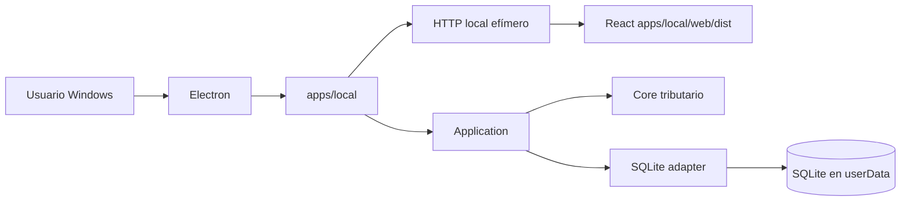
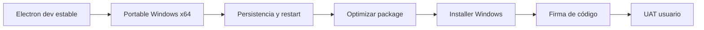

# Ruta desktop con Electron

Personal Tax Ledger adopta Electron como superficie desktop para Windows, preservando el runtime local existente como baseline estable durante la transición.

## Principio de compatibilidad

Electron es un adaptador de entrega adicional. No reemplaza `apps/local`, no mueve lógica tributaria al proceso Electron y no expone Node al renderer React.



## Etapa 1: wrapper compatible

La primera implementación ejecuta la misma aplicación local existente dentro del lifecycle de Electron:

1. Electron obtiene su directorio `userData`.
2. Define `DB_PATH` hacia `userData/data/personal-tax-ledger.sqlite`.
3. Crea `apps/local` con puerto `0` para que el sistema operativo asigne un puerto libre.
4. Espera el inicio del servidor.
5. Abre `BrowserWindow` contra el endpoint local.
6. Al cerrar, invoca `createLocalApp().stop()` para cerrar HTTP y SQLite ordenadamente.

## Perfiles de ejecución

| Perfil | Runtime | Propósito |
|---|---|---|
| DEV | WSL2/Ubuntu + Node/npm | Desarrollo y debugging |
| UAT técnico | Windows nativo, sin requerir Git ni Node para ejecutar el artefacto | Validar compatibilidad, persistencia y lifecycle |
| UAT usuario | Windows nativo + instalador autocontenido | Validar experiencia no técnica |

## Criterios de estabilidad

Durante la transición deben continuar pasando, sin depender de Electron:

```text
npm test
npm run build
npm run smoke:local
npm run architecture:check
npm start
```

El camino desktop añade:

```text
npm run desktop:check
npm run desktop:dev
npm run desktop:runtime
npm run desktop:package
npm run desktop:package:win
```

## Dependencias reproducibles

La rama desktop fija explícitamente:

- `electron` 44.2.0;
- `@electron/packager` 20.3.0.

Electron Forge queda diferido hasta el gate de instalador, para no incorporar makers ni dependencias adicionales mientras se valida el runtime portable.

El `package-lock.json` debe mantenerse sincronizado antes de volver a usar `npm ci`.

## Staging runtime autocontenido

El empaquetado no usa directamente el root del monorepo. `scripts/build-desktop-runtime.mjs` construye `.desktop-runtime/` con solamente lo requerido para ejecutar la aplicación:

```mermaid
flowchart TD
    R[Workspace de desarrollo] --> B[npm run build]
    B --> S[scripts/build-desktop-runtime.mjs]
    S --> D[.desktop-runtime]
    D --> A[apps/desktop]
    D --> L[apps/local/src + web/dist]
    D --> N[node_modules/@personal-tax-ledger]
    N --> P[Paquetes internos materializados físicamente]
    D --> E[@electron/packager]
    E --> O[out/Personal Tax Ledger-win32-x64]
```

Los paquetes internos runtime se copian como directorios físicos bajo `node_modules/@personal-tax-ledger`; el staging rechaza symlinks de workspace. Esto evita que un artefacto generado desde WSL dependa de enlaces npm válidos sólo en Linux.

El staging excluye deliberadamente `.github`, documentación, tests, scripts de desarrollo, configuración Git y demás contenido no requerido por el runtime.

## Empaquetado Windows: gate portable

El gate actual es un paquete Windows x64 generado directamente con `@electron/packager`, no un instalador. Se genera con:

```text
npm run desktop:package:win
```

La salida queda bajo `out/` y debe poder copiarse a Windows y ejecutarse sin Git, Node, npm ni WSL.

Durante este gate se mantienen temporalmente:

- `asar: false`;
- `prune: false`.

Esto prioriza resolución correcta del runtime y diagnósticos sobre tamaño. Una vez validado el portable, el siguiente gate habilita poda/ASAR y posteriormente el tooling de instalador Windows.

## Seguridad inicial

La ventana desktop ejecuta el renderer con:

- `contextIsolation: true`
- `nodeIntegration: false`
- `sandbox: true`
- single-instance lock

## Gates siguientes



La firma de código se incorpora en el gate de distribución final; no bloquea la validación técnica del paquete portable inicial.
