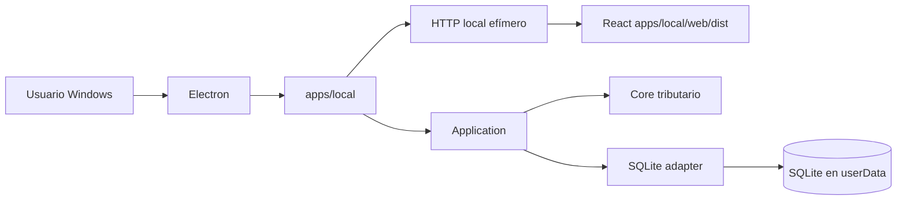
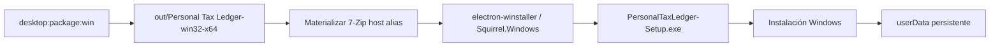
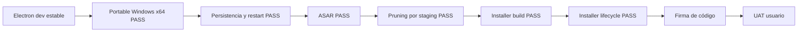

# Ruta desktop con Electron

Personal Tax Ledger adopta Electron como superficie desktop para Windows, preservando el runtime local existente como baseline estable durante la transición.

> Estado 2026-09-04: el gate funcional de distribución Windows está cerrado. La configuración final, las lecciones aprendidas y la evidencia UAT quedaron separadas en [`docs/desktop/`](desktop/README.md).

## Principio de compatibilidad

Electron es un adaptador de entrega adicional. No reemplaza `apps/local`, no mueve lógica tributaria al proceso Electron y no expone Node al renderer React.



## Etapa 1: wrapper compatible

La implementación ejecuta la misma aplicación local existente dentro del lifecycle de Electron:

1. Electron obtiene su directorio `userData`.
2. Define `DB_PATH` hacia `userData/data/personal-tax-ledger.sqlite`.
3. Crea `apps/local` con puerto `0` para que el sistema operativo asigne un puerto libre.
4. Espera el inicio del servidor.
5. Abre `BrowserWindow` contra el endpoint local.
6. Al cerrar, invoca `createLocalApp().stop()` para cerrar HTTP y SQLite ordenadamente.

## Perfiles de ejecución

| Perfil | Runtime | Propósito |
|---|---|---|
| DEV | WSL2/Ubuntu + Node/npm | Desarrollo y debugging |
| UAT técnico | Windows nativo, sin requerir Git ni Node para ejecutar el artefacto | Validar compatibilidad, persistencia y lifecycle |
| UAT usuario | Windows nativo + instalador autocontenido | Validar experiencia no técnica |

## Criterios de estabilidad

El runtime local continúa validándose independientemente de Electron:

```text
npm test
npm run build
npm run smoke:local
npm run architecture:check
npm start
```

El camino desktop añade:

```text
npm run desktop:check
npm run desktop:dev
npm run desktop:runtime
npm run desktop:package
npm run desktop:package:win
npm run desktop:installer:win
```

## Dependencias reproducibles

La rama desktop fija explícitamente:

- `electron` 44.2.0;
- `@electron/packager` 20.3.0;
- `electron-winstaller` 5.4.4.

Electron Forge no se reincorpora: el portable se genera con `@electron/packager` y el instalador directamente con `electron-winstaller` / Squirrel.Windows.

## Staging runtime autocontenido

El empaquetado no usa directamente el root del monorepo. `scripts/build-desktop-runtime.mjs` construye `.desktop-runtime/` con solamente lo requerido para ejecutar la aplicación:

```mermaid
flowchart TD
    R[Workspace de desarrollo] --> B[npm run build]
    B --> S[scripts/build-desktop-runtime.mjs]
    S --> D[.desktop-runtime]
    D --> A[apps/desktop]
    D --> L[apps/local/src + web/dist]
    D --> N[node_modules/@personal-tax-ledger]
    N --> P[Paquetes internos materializados físicamente]
    D --> E[@electron/packager]
    E --> O[out/Personal Tax Ledger-win32-x64]
```

Los paquetes internos runtime se copian como directorios físicos bajo `node_modules/@personal-tax-ledger`; el staging rechaza symlinks de workspace. El staging excluye `.github`, documentación, tests, scripts de desarrollo, configuración Git y demás contenido no requerido por el runtime.

## Empaquetado Windows: baseline validado

El artefacto Windows x64 se genera directamente con `@electron/packager` mediante:

```text
npm run desktop:package:win
```

La configuración validada queda:

- `asar: true`;
- `prune: false` en `@electron/packager`;
- pruning determinista previo en `scripts/build-desktop-runtime.mjs`.

ASAR empaqueta la superficie JavaScript/JSON de la aplicación en `resources/app.asar`. No es cifrado ni una barrera de seguridad.

### Por qué `prune: true` no se usa en Packager

Se probó explícitamente `asar: true` + `prune: true`. El artefacto se generó, pero al arrancar falló con `ERR_MODULE_NOT_FOUND` para `@personal-tax-ledger/contracts`.

La causa es estructural: `.desktop-runtime` materializa manualmente los paquetes `@personal-tax-ledger/*`, mientras que su `package.json` mínimo no los declara como dependencias npm instalables. El pruning genérico los clasifica como extraneous y los elimina antes de crear `app.asar`.

Por lo tanto, PTL mantiene `prune: false` y conserva el pruning especializado en `build-desktop-runtime.mjs`.

## Instalador Windows

El instalador se construye sobre el paquete ASAR ya validado:



El comando es:

```text
npm run desktop:installer:win
```

`scripts/create-windows-installer.mjs` genera `out/installer-win32-x64/PersonalTaxLedger-Setup.exe`. La configuración inicial validada usa `noMsi: true` y `noDelta: true`.

### Materialización determinista de 7-Zip para Squirrel

`electron-winstaller@5.4.4` distribuye variantes `vendor/7z-x64.*` / `vendor/7z-arm64.*`, mientras Squirrel espera aliases `vendor/7z.exe` y `vendor/7z.dll` durante `CreateZipFromDirectory`.

PTL realiza la selección explícitamente dentro de `scripts/create-windows-installer.mjs`:

1. detecta la arquitectura del host mediante `os.arch()`;
2. valida `x64` o `arm64`;
3. valida los binarios esperados;
4. copia `7z-${hostArch}.exe/.dll` hacia `7z.exe/.dll`;
5. verifica los aliases antes de invocar `createWindowsInstaller()`.

El build Squirrel desde WSL/Linux quedó validado con Mono + Wine; el soporte i386/WoW64 fue necesario para helpers del toolchain, no para el producto final x64.

## Lifecycle Squirrel y datos

El proceso principal reconoce:

- `--squirrel-install`;
- `--squirrel-updated`;
- `--squirrel-uninstall`;
- `--squirrel-obsolete`.

Los datos tributarios continúan fuera del directorio de instalación, bajo `app.getPath('userData')`.

El 2026-09-04 se validó manualmente en Windows:

- ejecución del Setup.exe;
- aplicación instalada funcional;
- desinstalación;
- nueva instalación posterior;
- instalación sobre instalación existente;
- continuidad de los datos durante todo el lifecycle observado.

Esto confirma el contrato operativo **binarios instalados ≠ datos persistidos**.

## Resultado de gates



El gate funcional de distribución desktop queda **PASS**. Firma de código, estrategia formal de update/autoupdate, backup/migraciones de datos y UAT de usuario no técnico son slices posteriores.

## Documentación de cierre

- [Configuración final](desktop/final-configuration.md)
- [Lecciones aprendidas](desktop/lessons-learned.md)
- [Evidencia UAT técnica](desktop/uat-evidence-2026-09-04.md)

## Seguridad inicial

La ventana desktop ejecuta el renderer con:

- `contextIsolation: true`
- `nodeIntegration: false`
- `sandbox: true`
- single-instance lock implementado.