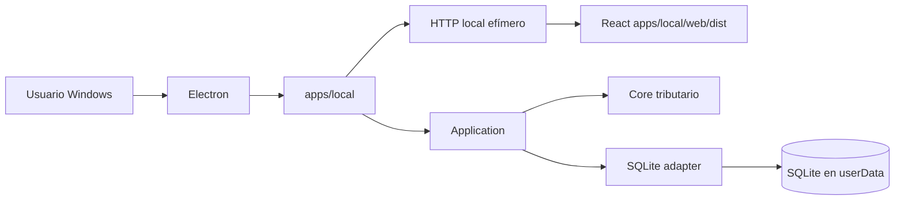
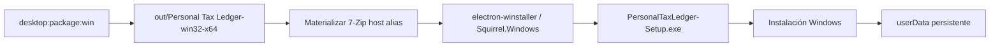
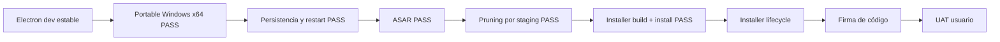

# Ruta desktop con Electron

Personal Tax Ledger adopta Electron como superficie desktop para Windows, preservando el runtime local existente como baseline estable durante la transición.

## Principio de compatibilidad

Electron es un adaptador de entrega adicional. No reemplaza `apps/local`, no mueve lógica tributaria al proceso Electron y no expone Node al renderer React.



## Etapa 1: wrapper compatible

La primera implementación ejecuta la misma aplicación local existente dentro del lifecycle de Electron:

1. Electron obtiene su directorio `userData`.
2. Define `DB_PATH` hacia `userData/data/personal-tax-ledger.sqlite`.
3. Crea `apps/local` con puerto `0` para que el sistema operativo asigne un puerto libre.
4. Espera el inicio del servidor.
5. Abre `BrowserWindow` contra el endpoint local.
6. Al cerrar, invoca `createLocalApp().stop()` para cerrar HTTP y SQLite ordenadamente.

## Perfiles de ejecución

| Perfil | Runtime | Propósito |
|---|---|---|
| DEV | WSL2/Ubuntu + Node/npm | Desarrollo y debugging |
| UAT técnico | Windows nativo, sin requerir Git ni Node para ejecutar el artefacto | Validar compatibilidad, persistencia y lifecycle |
| UAT usuario | Windows nativo + instalador autocontenido | Validar experiencia no técnica |

## Criterios de estabilidad

Durante la transición deben continuar pasando, sin depender de Electron:

```text
npm test
npm run build
npm run smoke:local
npm run architecture:check
npm start
```

El camino desktop añade:

```text
npm run desktop:check
npm run desktop:dev
npm run desktop:runtime
npm run desktop:package
npm run desktop:package:win
npm run desktop:installer:win
```

## Dependencias reproducibles

La rama desktop fija explícitamente:

- `electron` 44.2.0;
- `@electron/packager` 20.3.0;
- `electron-winstaller` 5.4.4 para el gate de instalador Windows.

Electron Forge no se reincorpora: el instalador se genera directamente con `electron-winstaller`, que es la implementación Squirrel.Windows usada por el maker Squirrel de Forge, evitando volver a introducir el toolchain pesado que ya había generado fricción con npm 12.

El `package-lock.json` debe mantenerse sincronizado y se exige `npm ci`/`npm audit` verdes.

## Staging runtime autocontenido

El empaquetado no usa directamente el root del monorepo. `scripts/build-desktop-runtime.mjs` construye `.desktop-runtime/` con solamente lo requerido para ejecutar la aplicación:

```mermaid
flowchart TD
    R[Workspace de desarrollo] --> B[npm run build]
    B --> S[scripts/build-desktop-runtime.mjs]
    S --> D[.desktop-runtime]
    D --> A[apps/desktop]
    D --> L[apps/local/src + web/dist]
    D --> N[node_modules/@personal-tax-ledger]
    N --> P[Paquetes internos materializados físicamente]
    D --> E[@electron/packager]
    E --> O[out/Personal Tax Ledger-win32-x64]
```

Los paquetes internos runtime se copian como directorios físicos bajo `node_modules/@personal-tax-ledger`; el staging rechaza symlinks de workspace. Esto evita que un artefacto generado desde WSL dependa de enlaces npm válidos sólo en Linux.

El staging excluye deliberadamente `.github`, documentación, tests, scripts de desarrollo, configuración Git y demás contenido no requerido por el runtime. Ese recorte constituye el pruning efectivo de PTL: es explícito, determinista y conoce la arquitectura real del monorepo.

## Empaquetado Windows: baseline validado

El artefacto Windows x64 se genera directamente con `@electron/packager` mediante:

```text
npm run desktop:package:win
```

La configuración validada queda:

- `asar: true`;
- `prune: false` en `@electron/packager`;
- pruning determinista previo en `scripts/build-desktop-runtime.mjs`.

ASAR empaqueta la superficie JavaScript/JSON de la aplicación en `resources/app.asar`. No es cifrado ni una barrera de seguridad: su propósito principal es empaquetado, orden y una superficie de distribución más compacta.

### Por qué `prune: true` no se usa en Packager

Se probó explícitamente `asar: true` + `prune: true` en Windows nativo. El artefacto se generó, pero al arrancar falló con `ERR_MODULE_NOT_FOUND` para `@personal-tax-ledger/contracts`.

La causa es estructural: `.desktop-runtime` materializa manualmente los paquetes `@personal-tax-ledger/*` bajo `node_modules`, mientras que su `package.json` mínimo no los declara como dependencias instalables de npm. El pruning genérico de `@electron/packager` los clasifica como extraneous y los elimina antes de crear `app.asar`.

Por lo tanto, PTL mantiene `prune: false` y conserva el pruning especializado en `build-desktop-runtime.mjs`.

## Instalador Windows

El instalador se construye sobre el paquete ASAR ya validado, sin volver a empaquetar la aplicación desde otra herramienta:



El comando es:

```text
npm run desktop:installer:win
```

`scripts/create-windows-installer.mjs` genera `out/installer-win32-x64/PersonalTaxLedger-Setup.exe`. Para el primer gate se genera EXE solamente (`noMsi: true`) y se deshabilitan paquetes delta (`noDelta: true`) para no mezclar todavía la estrategia de auto-update.

### Materialización determinista de 7-Zip para Squirrel

`electron-winstaller@5.4.4` distribuye variantes por arquitectura (`vendor/7z-x64.exe`, `vendor/7z-x64.dll`, `vendor/7z-arm64.exe`, `vendor/7z-arm64.dll`) y Squirrel espera aliases genéricos `vendor/7z.exe` y `vendor/7z.dll` durante `CreateZipFromDirectory`.

En el entorno WSL observado, el lifecycle `select-7z-arch.js` del paquete no dejó esos aliases materializados. Para evitar depender de ese side effect, PTL realiza la selección explícitamente dentro de `scripts/create-windows-installer.mjs`:

1. detecta la arquitectura real del host mediante `os.arch()`;
2. valida que sea `x64` o `arm64`;
3. valida que existan los binarios versionados esperados;
4. copia `7z-${hostArch}.exe/.dll` hacia `7z.exe/.dll`;
5. comprueba que los aliases existan antes de invocar `createWindowsInstaller()`.

Esto no modifica la arquitectura del producto final; sólo asegura de forma determinista el helper de build requerido por Squirrel.

El proceso principal reconoce los eventos Squirrel `--squirrel-install`, `--squirrel-updated`, `--squirrel-uninstall` y `--squirrel-obsolete`. En instalación/actualización crea el acceso directo; en desinstalación lo elimina. Los datos tributarios continúan fuera del directorio de instalación, bajo `app.getPath('userData')`, por lo que una actualización o reinstalación no debe reemplazar la base SQLite.

Cuando el instalador se genera desde Linux/WSL, el script ejecuta un preflight y exige Mono + Wine, dependencias de host necesarias para construir Squirrel.Windows fuera de Windows. Esta dependencia pertenece al workspace de build, no al PC del usuario final.

## Evidencia de validación Windows

El 2026-09-04 se validó manualmente el artefacto `win32-x64` en Windows nativo, copiado desde WSL como carpeta portable completa.

Resultado observado:

- `PersonalTaxLedger.exe` abrió correctamente sin requerir Git, Node, npm ni WSL en Windows;
- el runtime materializado resolvió correctamente los paquetes internos `@personal-tax-ledger/*`;
- la interfaz cargó y permitió ingresar/modificar datos reales de prueba;
- la aplicación cerró normalmente;
- al volver a abrirla, los datos previamente ingresados continuaron persistidos en SQLite;
- el staging quedó sin symlinks de workspace, `.github`, documentación, tests ni scripts de desarrollo;
- ASAR fue validado en Windows nativo sobre la misma base `userData`;
- el experimento `prune: true` confirmó que el pruning genérico es incompatible con el staging materializado y debe permanecer deshabilitado.

El 2026-09-04 también se completó el build cross-platform del instalador Squirrel desde WSL, incluyendo la materialización determinista de `7z.exe`/`7z.dll`. El artefacto `PersonalTaxLedger-Setup.exe` fue copiado a Windows, ejecutado e instalado exitosamente; la aplicación instalada abrió y funcionó correctamente según validación manual del operador.

Por lo tanto, quedan validados **Portable Windows x64**, **arranque nativo**, **cierre/reapertura**, **persistencia básica**, **ASAR**, **pruning determinista por staging**, **build del instalador Squirrel** e **instalación/arranque inicial desde Setup.exe**. Permanecen como pruebas específicas de lifecycle antes de cerrar completamente el gate de distribución: reinstalación/upgrade, desinstalación con preservación de `userData`, acceso directo y single-instance explícitos.

## Seguridad inicial

La ventana desktop ejecuta el renderer con:

- `contextIsolation: true`
- `nodeIntegration: false`
- `sandbox: true`
- single-instance lock

## Gates siguientes



La firma de código se incorpora después de validar el lifecycle del instalador; no bloquea el UAT técnico inicial del Setup.exe.
