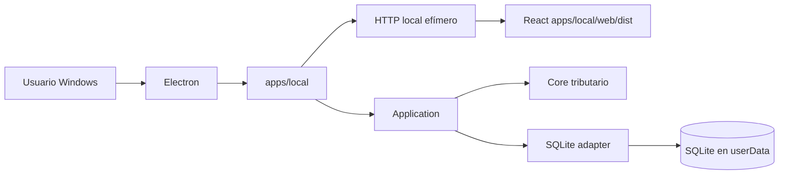

# Ruta desktop con Electron

Personal Tax Ledger adopta Electron como superficie desktop para Windows, preservando el runtime local existente como baseline estable durante la transición.

## Principio de compatibilidad

Electron es un adaptador de entrega adicional. No reemplaza `apps/local`, no mueve lógica tributaria al proceso Electron y no expone Node al renderer React.



## Etapa 1: wrapper compatible

La primera implementación ejecuta la misma aplicación local existente dentro del lifecycle de Electron:

1. Electron obtiene su directorio `userData`.
2. Define `DB_PATH` hacia `userData/data/personal-tax-ledger.sqlite`.
3. Crea `apps/local` con puerto `0` para que el sistema operativo asigne un puerto libre.
4. Espera el inicio del servidor.
5. Abre `BrowserWindow` contra el endpoint local.
6. Al cerrar, invoca `createLocalApp().stop()` para cerrar HTTP y SQLite ordenadamente.

## Perfiles de ejecución

| Perfil | Runtime | Propósito |
|---|---|---|
| DEV | WSL2/Ubuntu + Node/npm | Desarrollo y debugging |
| UAT técnico | Windows nativo + Node/npm + Electron temporal | Validar compatibilidad y lifecycle |
| UAT usuario | Windows nativo + instalador autocontenido | Validar experiencia no técnica |

## Criterios de estabilidad

Durante la transición deben continuar pasando, sin depender de Electron:

```text
npm test
npm run build
npm run smoke:local
npm run architecture:check
npm start
```

El camino desktop añade:

```text
npm run desktop:check
npm run desktop:dev
```

## Seguridad inicial

La ventana desktop ejecuta el renderer con:

- `contextIsolation: true`
- `nodeIntegration: false`
- `sandbox: true`
- single-instance lock

## Siguiente gate

Antes de introducir empaquetado definitivo se debe validar el mismo commit en WSL2 y Windows nativo. Después se incorporará Electron al lockfile de forma reproducible y se añadirá un empaquetador Windows para generar una instalación autocontenida.
