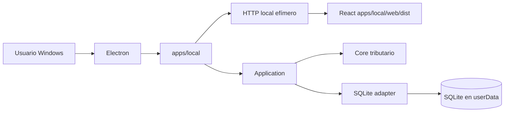
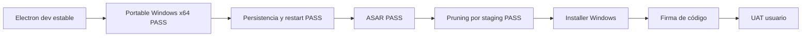

# Ruta desktop con Electron

Personal Tax Ledger adopta Electron como superficie desktop para Windows, preservando el runtime local existente como baseline estable durante la transición.

## Principio de compatibilidad

Electron es un adaptador de entrega adicional. No reemplaza `apps/local`, no mueve lógica tributaria al proceso Electron y no expone Node al renderer React.



## Etapa 1: wrapper compatible

La primera implementación ejecuta la misma aplicación local existente dentro del lifecycle de Electron:

1. Electron obtiene su directorio `userData`.
2. Define `DB_PATH` hacia `userData/data/personal-tax-ledger.sqlite`.
3. Crea `apps/local` con puerto `0` para que el sistema operativo asigne un puerto libre.
4. Espera el inicio del servidor.
5. Abre `BrowserWindow` contra el endpoint local.
6. Al cerrar, invoca `createLocalApp().stop()` para cerrar HTTP y SQLite ordenadamente.

## Perfiles de ejecución

| Perfil | Runtime | Propósito |
|---|---|---|
| DEV | WSL2/Ubuntu + Node/npm | Desarrollo y debugging |
| UAT técnico | Windows nativo, sin requerir Git ni Node para ejecutar el artefacto | Validar compatibilidad, persistencia y lifecycle |
| UAT usuario | Windows nativo + instalador autocontenido | Validar experiencia no técnica |

## Criterios de estabilidad

Durante la transición deben continuar pasando, sin depender de Electron:

```text
npm test
npm run build
npm run smoke:local
npm run architecture:check
npm start
```

El camino desktop añade:

```text
npm run desktop:check
npm run desktop:dev
npm run desktop:runtime
npm run desktop:package
npm run desktop:package:win
```

## Dependencias reproducibles

La rama desktop fija explícitamente:

- `electron` 44.2.0;
- `@electron/packager` 20.3.0.

Electron Forge queda diferido hasta el gate de instalador, para no incorporar makers ni dependencias adicionales mientras se valida el runtime portable.

El `package-lock.json` quedó sincronizado y `npm ci` funciona sin `.npmrc` especial. El audit vigente quedó en cero vulnerabilidades tras actualizar la resolución de `nanoid`.

## Staging runtime autocontenido

El empaquetado no usa directamente el root del monorepo. `scripts/build-desktop-runtime.mjs` construye `.desktop-runtime/` con solamente lo requerido para ejecutar la aplicación:

```mermaid
flowchart TD
    R[Workspace de desarrollo] --> B[npm run build]
    B --> S[scripts/build-desktop-runtime.mjs]
    S --> D[.desktop-runtime]
    D --> A[apps/desktop]
    D --> L[apps/local/src + web/dist]
    D --> N[node_modules/@personal-tax-ledger]
    N --> P[Paquetes internos materializados físicamente]
    D --> E[@electron/packager]
    E --> O[out/Personal Tax Ledger-win32-x64]
```

Los paquetes internos runtime se copian como directorios físicos bajo `node_modules/@personal-tax-ledger`; el staging rechaza symlinks de workspace. Esto evita que un artefacto generado desde WSL dependa de enlaces npm válidos sólo en Linux.

El staging excluye deliberadamente `.github`, documentación, tests, scripts de desarrollo, configuración Git y demás contenido no requerido por el runtime. Ese recorte constituye el pruning efectivo de PTL: es explícito, determinista y conoce la arquitectura real del monorepo.

## Empaquetado Windows: gate portable

El artefacto Windows x64 se genera directamente con `@electron/packager` mediante:

```text
npm run desktop:package:win
```

La salida queda bajo `out/` y debe poder copiarse a Windows y ejecutarse sin Git, Node, npm ni WSL.

La configuración validada queda:

- `asar: true`;
- `prune: false` en `@electron/packager`;
- pruning determinista previo en `scripts/build-desktop-runtime.mjs`.

ASAR empaqueta la superficie JavaScript/JSON de la aplicación en `resources/app.asar` en vez de dejarla expandida bajo `resources/app`. No es cifrado ni una barrera de seguridad: su propósito principal es empaquetado, orden y una superficie de distribución más compacta.

### Por qué `prune: true` no se usa en Packager

Se probó explícitamente `asar: true` + `prune: true` en Windows nativo. El artefacto se generó, pero al arrancar falló con `ERR_MODULE_NOT_FOUND` para `@personal-tax-ledger/contracts`.

La causa es estructural: `.desktop-runtime` materializa manualmente los paquetes `@personal-tax-ledger/*` bajo `node_modules`, mientras que su `package.json` mínimo no los declara como dependencias instalables de npm. El pruning genérico de `@electron/packager` los clasifica como extraneous y los elimina antes de crear `app.asar`.

Por lo tanto, habilitar `prune: true` en Packager sería incorrecto para esta estrategia de staging. PTL mantiene `prune: false` y conserva el pruning especializado en `build-desktop-runtime.mjs`, que ya elimina tests, docs, scripts y demás contenido no requerido sin destruir los módulos internos runtime.

## Evidencia de validación Windows

El 2026-09-04 se validó manualmente el artefacto `win32-x64` en Windows nativo, copiado desde WSL como carpeta portable completa.

Resultado observado:

- `PersonalTaxLedger.exe` abrió correctamente sin requerir Git, Node, npm ni WSL en Windows;
- el runtime materializado resolvió correctamente los paquetes internos `@personal-tax-ledger/*`;
- la interfaz cargó y permitió ingresar/modificar datos reales de prueba;
- la aplicación cerró normalmente;
- al volver a abrirla, los datos previamente ingresados continuaron persistidos en SQLite;
- el staging quedó sin symlinks de workspace, `.github`, documentación, tests ni scripts de desarrollo.

El gate ASAR también fue validado en Windows nativo: la build con `app.asar` abrió, operó sobre la misma base `userData`, leyó datos creados por la build anterior, permitió modificarlos y conservó persistencia tras cierre y reapertura. Esto evidencia además compatibilidad básica de upgrade entre el baseline portable y la build ASAR.

La prueba de `prune: true` se considera un experimento negativo controlado: confirmó que el pruning genérico es incompatible con el staging materializado actual y que debe permanecer deshabilitado. No invalida el pruning efectivo del producto, que ocurre antes del packager mediante el staging mínimo.

Por lo tanto, quedan validados **Portable Windows x64**, **arranque nativo**, **cierre/reapertura**, **persistencia básica**, **ASAR** y **pruning determinista por staging**. La validación explícita de single-instance se mantiene como comprobación menor pendiente antes del instalador.

## Seguridad inicial

La ventana desktop ejecuta el renderer con:

- `contextIsolation: true`
- `nodeIntegration: false`
- `sandbox: true`
- single-instance lock

## Gates siguientes



La firma de código se incorpora en el gate de distribución final; no bloquea la validación técnica del paquete portable inicial.
