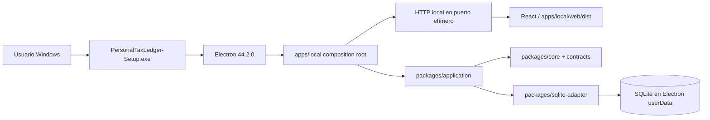

# Configuración final de distribución desktop

Estado validado: 2026-09-04.

## Objetivo

Distribuir Personal Tax Ledger como aplicación Windows autocontenida para UAT no técnico, preservando la arquitectura hexagonal actual y sin exigir Git, Node.js, npm, WSL ni herramientas de desarrollo en el PC del usuario.

## Composición validada



Electron es un adaptador de entrega. No contiene reglas tributarias y no reemplaza `apps/local`.

## Runtime desktop

Archivo principal: `apps/desktop/main.mjs`.

Propiedades de seguridad de `BrowserWindow`:

- `contextIsolation: true`;
- `nodeIntegration: false`;
- `sandbox: true`;
- single-instance lock implementado mediante `app.requestSingleInstanceLock()`.

La aplicación levanta el composition root local con puerto `0`, espera que el sistema operativo asigne un puerto libre y carga la UI desde el HTTP local.

## Datos y persistencia

La base desktop vive fuera del directorio de instalación:

```text
app.getPath('userData')/data/personal-tax-ledger.sqlite
```

Consecuencias intencionales:

- dos copias del mismo producto comparten el mismo perfil de datos;
- mover o reemplazar binarios no mueve la base;
- reinstalar o instalar sobre una instalación existente conserva los datos;
- desinstalar la aplicación no debe borrar `userData`;
- una futura versión puede actualizar binarios sin sustituir la SQLite del usuario.

## Staging autocontenido

El empaquetado no usa directamente el monorepo. `scripts/build-desktop-runtime.mjs` crea `.desktop-runtime/` y materializa físicamente los paquetes internos requeridos:

- `@personal-tax-ledger/api-contracts`;
- `@personal-tax-ledger/application`;
- `@personal-tax-ledger/contracts`;
- `@personal-tax-ledger/core`;
- `@personal-tax-ledger/http-api`;
- `@personal-tax-ledger/sqlite-adapter`.

```mermaid
flowchart TD
    R[Workspace de desarrollo] --> B[npm run build]
    B --> T[build-desktop-runtime.mjs]
    T --> D[.desktop-runtime]
    D --> M[Paquetes internos físicos, sin symlinks]
    D --> P[@electron/packager]
    P --> A[resources/app.asar]
    A --> O[out/Personal Tax Ledger-win32-x64]
    O --> I[electron-winstaller / Squirrel.Windows]
    I --> X[PersonalTaxLedger-Setup.exe]
```

El staging excluye tests, documentación, `.github`, scripts de desarrollo y otros contenidos que no forman parte del runtime.

## Electron Packager

Versiones fijadas:

- `electron`: `44.2.0`;
- `@electron/packager`: `20.3.0`.

API programática correcta:

```js
import { packager } from '@electron/packager';
```

Configuración final validada:

```js
asar: true,
prune: false
```

### ASAR

ASAR está habilitado y validado en Windows nativo. El runtime de aplicación queda empaquetado en `resources/app.asar`.

### Pruning

El pruning genérico de `@electron/packager` permanece deshabilitado. Al probar `prune: true`, Packager eliminó los paquetes internos materializados porque no son dependencias npm instaladas de forma convencional en el `package.json` sintético del staging.

El pruning efectivo ocurre antes, de forma determinista, en `build-desktop-runtime.mjs`.

## Instalador Windows

Tooling:

- `electron-winstaller`: `5.4.4`;
- Squirrel.Windows;
- `noMsi: true`;
- `noDelta: true`;
- nombre de salida: `PersonalTaxLedger-Setup.exe`.

Comando único:

```bash
npm run desktop:installer:win
```

Salida:

```text
out/installer-win32-x64/PersonalTaxLedger-Setup.exe
```

## Build del instalador desde WSL/Linux

El build cross-platform quedó validado desde WSL2/Ubuntu.

Requisitos de host:

- Mono;
- Wine 64-bit;
- soporte Wine i386/WoW64 cuando Squirrel ejecuta helpers Windows de 32 bits.

El soporte i386 pertenece sólo al host de build; el producto final continúa siendo Windows x64.

### 7-Zip de Squirrel

`electron-winstaller@5.4.4` entrega variantes `vendor/7z-x64.*` y `vendor/7z-arm64.*`, mientras Squirrel espera `vendor/7z.exe` y `vendor/7z.dll` durante `CreateZipFromDirectory`.

En el entorno observado, el lifecycle script del paquete no materializó esos aliases. `scripts/create-windows-installer.mjs` los crea explícitamente según `os.arch()` antes de invocar Squirrel. Esta corrección forma parte de la configuración final y no debe eliminarse sin una actualización de dependencia que demuestre resolver el problema.

## Lifecycle Squirrel

`apps/desktop/main.mjs` reconoce:

- `--squirrel-install`;
- `--squirrel-updated`;
- `--squirrel-uninstall`;
- `--squirrel-obsolete`.

La instalación/actualización administra el acceso directo y la desinstalación elimina el acceso directo sin borrar `userData`.

## Gates validados

| Gate | Estado |
|---|---|
| Electron dev composition | PASS |
| Portable Windows x64 | PASS |
| Resolución de paquetes internos | PASS |
| ASAR | PASS |
| Persistencia cierre/reapertura | PASS |
| Compatibilidad básica de datos entre builds | PASS |
| Pruning determinista por staging | PASS |
| Build Squirrel desde WSL | PASS |
| Instalación Windows | PASS |
| Reinstalación misma versión | PASS |
| Instalación sobre instalación existente | PASS |
| Desinstalación + nueva instalación | PASS |
| Preservación de datos durante lifecycle | PASS |

## Pendientes posteriores a este cierre

No forman parte del gate funcional ya cerrado:

- firma de código y reputación SmartScreen;
- estrategia formal de actualización/autoupdate;
- backup/export/restore y migraciones de datos para upgrades de esquema;
- UAT de usuario no técnico.