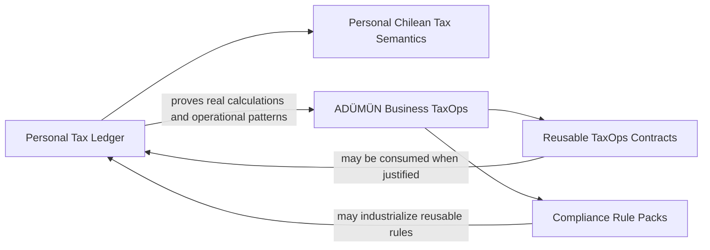

# ADÜMÜN governance and Business TaxOps relationship

Status: **ACTIVE / GOVERNED**

## Governance classification

Personal Tax Ledger is a **founder-personal asset governed under ADÜMÜN**.

Personal ownership does not place the project outside ADÜMÜN governance. It means the ownership scope is founder-personal rather than corporate-owned. The project may therefore use the same lifecycle, documentation, evidence, architecture and execution standards while preserving a distinct ownership boundary.

Current classification:

- governance: ADÜMÜN-governed;
- ownership scope: founder-personal;
- product status: active;
- canonical technical repository: `cmartinezs/personal-tax-ledger`;
- business-tax relationship: active reference consumer / proving ground for `adumun/business-taxops`.

## Relationship with Business TaxOps

Personal Tax Ledger and Business TaxOps overlap in tax-domain concepts but are not the same product or bounded context.

The intended relationship is bidirectional but ownership-preserving:

1. Personal Tax Ledger provides real, implemented and tested personal-tax behavior that can serve as reference evidence for Business TaxOps.
2. Business TaxOps may industrialize reusable contracts, rule packs, evidence models and operational tax capabilities.
3. Personal Tax Ledger may consume shared Business TaxOps capabilities when they provide value without erasing personal-domain semantics.
4. Neither repository gains ownership of the other's bounded context by reuse alone.

## Extraction and reuse rule

When a Personal Tax Ledger behavior is proven reusable beyond the founder-personal domain, evaluate it for one of these dispositions:

- retain in Personal Tax Ledger as personal-only semantics;
- expose through a versioned contract for external consumption;
- extract into a single canonical ADÜMÜN shared implementation after genuine reuse evidence exists;
- map into Business TaxOps contracts without copying implementation.

Do not duplicate a rule or implementation merely to move ownership. Preserve one canonical implementation source and use contract/conformance evidence around it.

## Tax ledger distinction

The Personal Tax Ledger annual ledger is an explainable personal tax and financial model.

Business TaxOps `tax-ledger-core` is an operational lineage of tax consequences, execution and evidence.

They may exchange information and reuse primitives, but they remain semantically distinct.

## Portfolio consequence

Personal Tax Ledger remains active as a founder-personal product while participating in the ADÜMÜN capability ecosystem as a real consumer/reference implementation. It is not legacy, not superseded, and not automatically converted into a corporate-owned Business TaxOps module.
